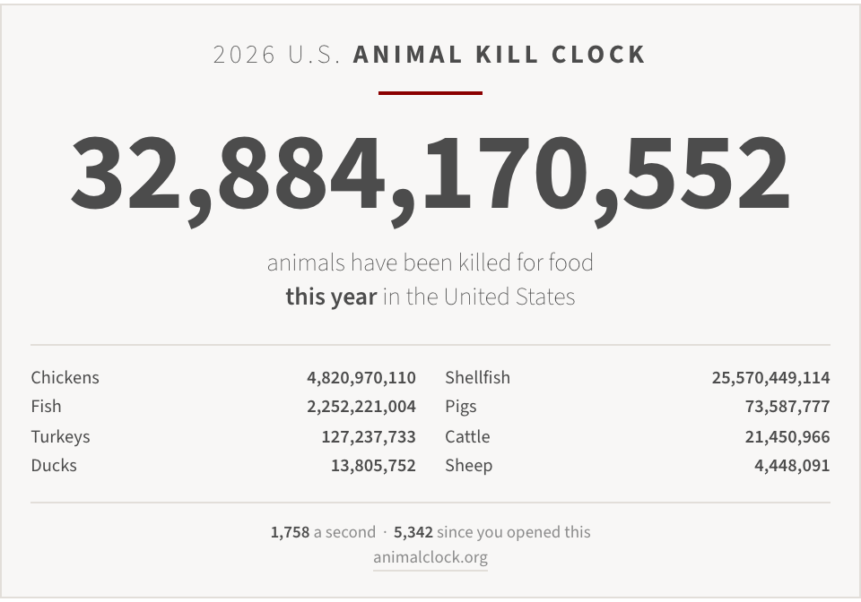

# Animal Kill Clock: a desktop widget

A live desktop widget version of the [U.S. Animal Kill Clock](https://animalclock.org):
a running count of the animals killed for food so far this year, in the same
spare style as the site.

Pinned to the desktop on macOS, and usable on Windows either as a
zero-install window or as a real desktop-level wallpaper widget.



## What's here

| Path                       | What it is                                                        |
| -------------------------- | ----------------------------------------------------------------- |
| `widget.html`              | The widget. Self-contained, no dependencies, works offline.        |
| `macos/widget_app.py`      | macOS host: a borderless WKWebView pinned at the desktop layer.    |
| `macos/make-app.sh`        | Builds `~/Desktop/Apps/Animal Kill Clock.app`.                     |
| `windows/AnimalKillClock.hta` | Windows, zero install. Double-click it.                        |
| `windows/README.md`        | Both Windows routes, including Lively Wallpaper.                   |

## macOS

```sh
./macos/make-app.sh
open ~/Desktop/Apps/"Animal Kill Clock.app"
```

Requires [uv](https://docs.astral.sh/uv/); the first launch resolves PyObjC and
caches it.

**Drag it anywhere.** Grab the card and move it; where you drop it is
remembered. Pick an anchor from the menu to snap it back to an edge.

The window sits just above your desktop icons and about two billion levels below
every normal window. So it is pinned rather than floating: it never covers
anything you're working in, never shows up in Cmd-Tab or Mission Control, and
follows you across every Space. There is no Dock tile; everything is under the
**Kill Clock** menu bar item, which also carries the running total so the number
is still readable when something full-screen covers the desktop.

From that menu:

- **Display**: *Pinned to Desktop* (the default, draggable), *Behind Desktop
  Icons* (true wallpaper level, so it can't be clicked or dragged), *Float Above
  Windows*, or *Normal Window*
- **Region**: United States, United Kingdom, Canada, Australia
- **Position**: nine anchors, plus **Reset Position** once you've dragged it
- **Size**, **Theme**, **Screen**, **Just the Number**, **Show Border**
- **Open at Login**: writes a LaunchAgent

Settings persist to `~/Library/Application Support/AnimalKillClock/config.json`.

### Why not a real macOS widget?

Because a native one can't tick. Apple's widget guidance covers WidgetKit
widgets, the kind that live in Notification Center and on the desktop, and it is
explicit that they "don't support continuous, real-time updates" and that update
frequency is limited. A clock counting 1,758 a second is exactly what that
budget rules out. Hence a small hosted window instead, placed to behave like a
widget: pinned, glanceable, and covering nothing.

## Windows

See [`windows/README.md`](windows/README.md). Short version: double-click
`windows/AnimalKillClock.hta` for a movable window with nothing to install, or
point [Lively Wallpaper](https://github.com/rocksdanister/lively) at
`widget.html` for one genuinely pinned behind your icons.

## Anywhere else

`widget.html` is just a web page. Open it in any browser, or point any widget
host at it. It sizes itself to whatever box it's given, from a 380px window up to
a 4K wallpaper, and needs no network (the webfont loads asynchronously and it
falls back to the system sans if you're offline).

Options go on the URL: `widget.html?region=uk&theme=dark&align=bottom-right`.
The full table is in `windows/README.md`.

## How the number is calculated

Same method as the source site: a per-second rate multiplied by the seconds
elapsed since January 1 in your local time zone. Nothing is fetched at runtime.

The headline uses each region's **published per-second rate** (1,758 for the
U.S.), not a rate re-derived from the annual totals. That distinction matters:
dividing the annual figures by the length of the year gives about 1,757.96 a
second, which looks more principled but drifts several hundred thousand below
the website by mid-year. Using the published integer keeps the two in step to
the digit.

The per-species lines then split that same headline in proportion to each
species' share of the annual total, so the rows still sum to the number above
them. Those U.S. annual figures are USDA slaughter data adjusted for imports,
exports and pre-slaughter mortality, plus the Counting Animals estimates for
fish and shellfish, roughly 55.4 billion a year. The other three countries are
published only as a per-second rate, so those clocks run a total with no
breakdown.

To refresh the numbers, read the FAQ table at animalclock.org and edit the
`REGIONS` block at the top of the script in `widget.html` (and the matching one
in the `.hta`). Nothing else needs to change.

## Credit

The clock, the research behind it, and the design this follows are the work of
[animalclock.org](https://animalclock.org). This repository is an independent
widget build: the code is written from scratch and none of the site's assets are
redistributed. If the widget is useful to you, the site is where the actual
argument and the sourcing live.
